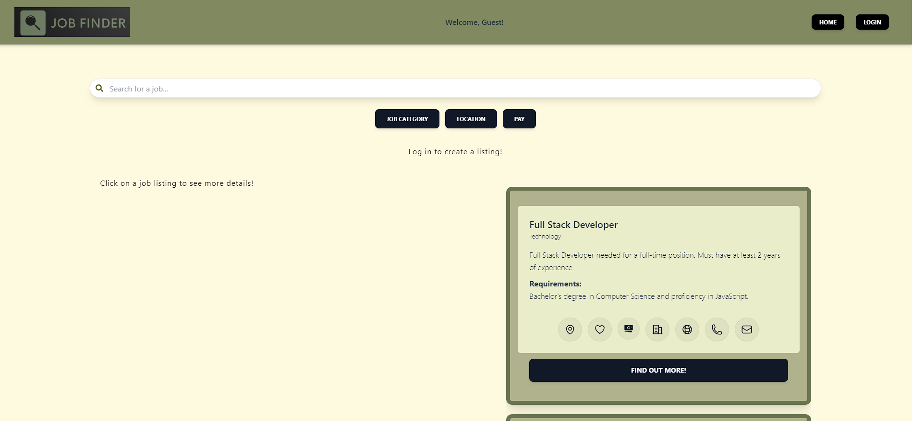
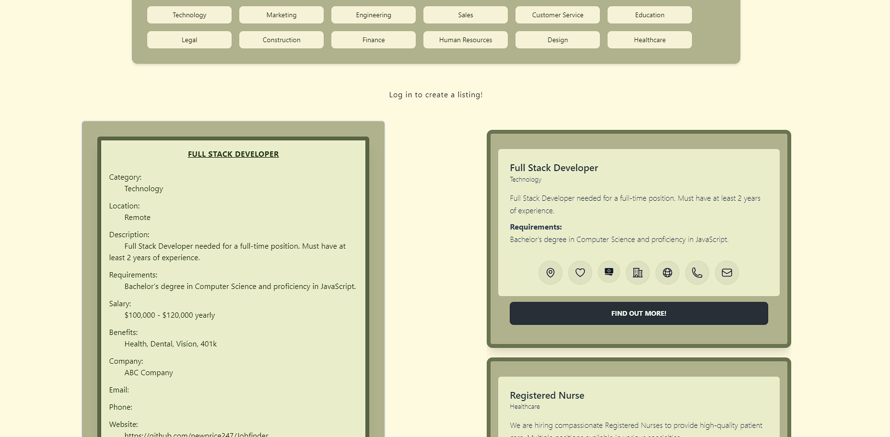
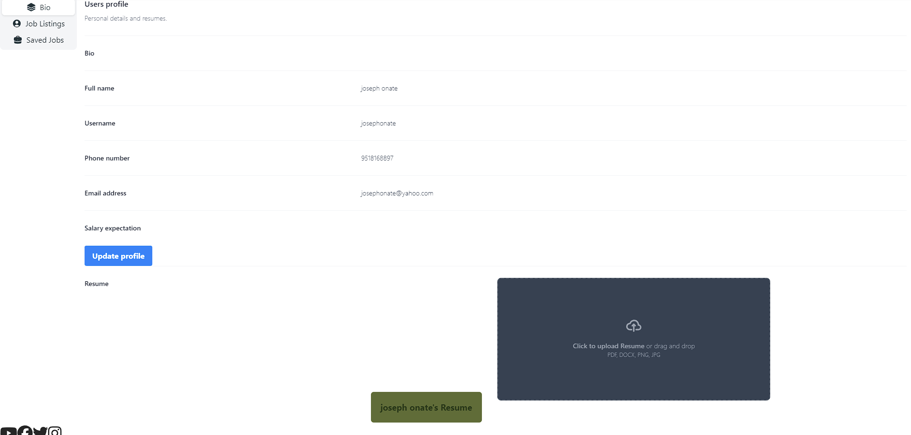
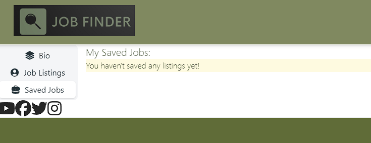
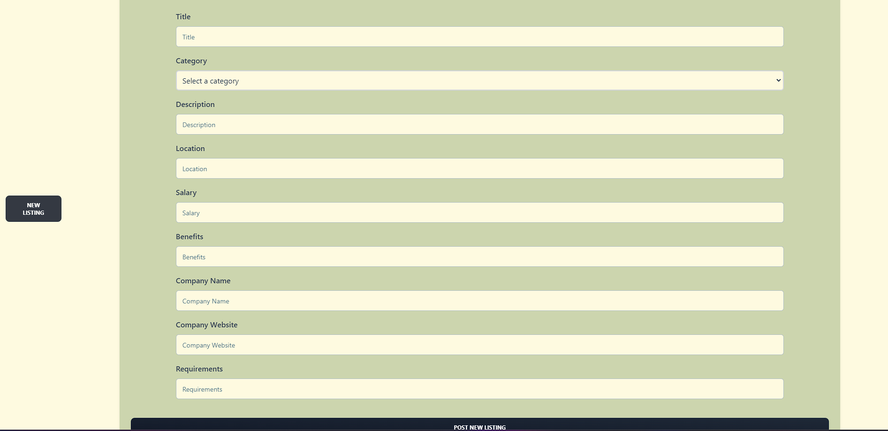

# JobFinder

## Description

A Job Board created by using the MERN fullstack. Where you are able to post jobs as an employer and search for jobs as a prospective employee

## Table of Contents

- [Installation](#installation)
- [Usage](#usage)
- [Credits](#credits)
- [Contribution](#contribution)
- [License](#license)
- [Questions](#questions)

## Installation

If you would like to install to your local machine:

- Clone the repository to your local machine and navigate to the folder in your node terminal
- Run 'npm install' from the terminal to import the necessary node modules
- Run 'npm run build to install creates a build directory with a production build of your app.
- Run 'npm run seed' to install the necessary seed data.
- Run 'npm hrc and hrs' inside the terminal to begin the application
- Navigate to 'localhost:5000' inside your browser to view the app

## Usage
- Access the application at http://localhost:5000 in your browser or on Heroku [project3mernstack](https://project3mernstack-c25ab63e2028.herokuapp.com/).
- View existing job listings on the homepage.
- login/register so you can save, apply or post jobs.
- Add a new job by filling out the form in the "Add a New Job" section.

## Demo

## Contribution

- Abigail Burtley | Slack name: Abigail | Github : Ariesscode
- Joseph Onate | Slack name: joseph onate | GitHub: Josephonate
- Nathaniel Price | Slack name: Nathaniel Price | Github : newprice247
- Yesenia Benitez | Slack name: Yesenia Benitez | Github: yeseniax2
- Katie Waters | Slack name: Katie Waters | Github: kwaters3

## Credits

- UCF Full-Time Full-Stack Coding Bootcamp
- Beszcoder.com: Provided tutorials on how to integrate multer into the blog site to upload images to the database
- Ali(TA) Came in at the end to save us a ton of time and headache trying to figure out how to revert back to a previous version of the site, he saved the day!

## Technologies Used

- @apollo/server
- bcrypt
- jsonwebtoken
- dotenv
- express
- mongodb
- mongoose
- nodemon
- @fortawesome/fontawesome-svg-core
- @fortawesome/free-brands-svg-icons
- @fortawesome/free-regular-svg-icons
- @fortawesome/free-solid-svg-icons
- @fortawesome/react-fontawesome
- @heroicons/react
- axios
- bootstrap
- firebase
- framer-motion
- react-bootstrap
- react-icons
- tw-elements-react
- uuid

## License

[MIT](https://opensource.org/licenses/MIT)

## Questions

Reach out to us if you have any questions about the project!

###

- JobFinder

  - Abigail Burtley | Slack name: Abigail | Github : Ariesscode
  - Joseph Onate | Slack name: joseph onate | GitHub: Josephonate
  - Nathaniel Price | Slack name: Nathaniel Price | Github : newprice247
  - Yesenia Benitez | Slack name: Yesenia Benitez | Github: yeseniax2
  - Katie Waters | Slack name: Katie Waters | Github: kwaters3

Heroku Deployment: https://project3mernstack-c25ab63e2028.herokuapp.com/
